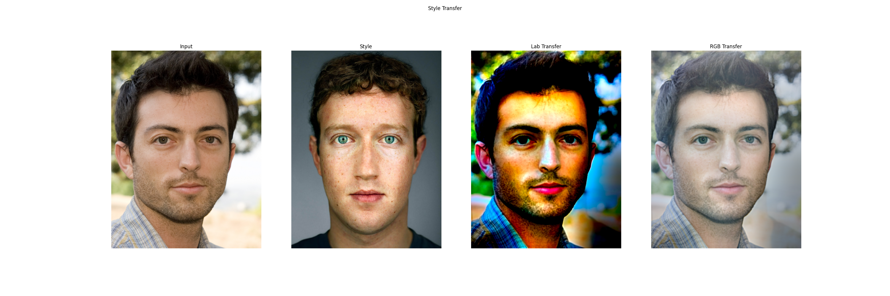
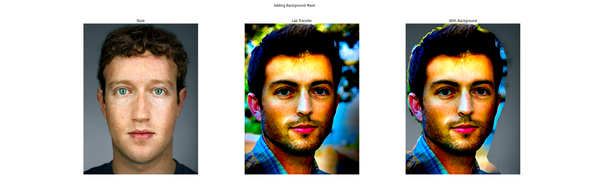
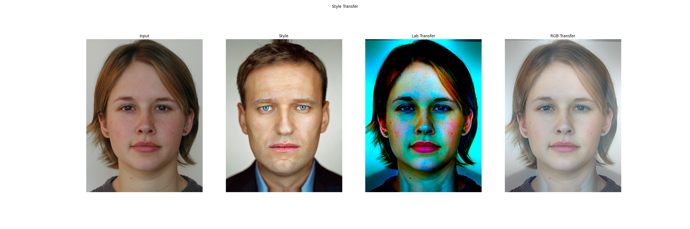
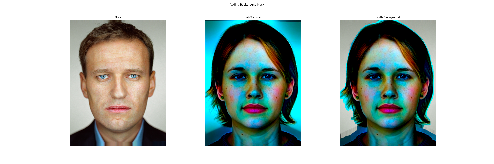

# Style Transfer for Headshot Portraits

## Brief Description

Our project is a style transfer technique between images for headshot portraits, that attempts to transfer features such as lighting, eye highlights, colors, etc. from example image to input image, purely based on Image Processing tenchiques. The technique is derived from the paper [{Style Transfer for Headshot Portraits}](https://people.csail.mit.edu/yichangshih/portrait_web/2014_portrait.pdf).

## Setup and Installation

- Download the Dataset from the [{Link}](http://groups.csail.mit.edu/graphics/face/tracker/release/zipfiles/data.zip)
- Install all given [{requirements.txt}](requirements.txt)
- Download `shape_detector` for `dlib` from this [{Link}](http://dlib.net/files/shape_predictor_68_face_landmarks.dat.bz2), or alternatively use the wget command from [main.ipynb](./src/main.ipynb).
- Run [main.ipynb](./src/main.ipynb)

## Sample outputs

**Success:**

**Not Success:**

## Team Information

- Anjali Singh - 2020102004
- Deepthi Chandak - 2020102013
- Aparna Agrawal - 2021121007
- Adhiraj Deshmukh - 2021121012

## Biblography:
- paper - [{Link}](https://people.csail.mit.edu/yichangshih/portrait_web/2014_portrait.pdf)
- dlib - [{Link}](https://www.pyimagesearch.com/2017/04/03/facial-landmarks-dlib-opencv-python/)
- delaunay+ wraping - [{Link}](https://www.learnopencv.com/face-morph-using-opencv-cpp-python/)
- baground removal -[{Link}](https://data-flair.training/blogs/python-remove-image-background/)
